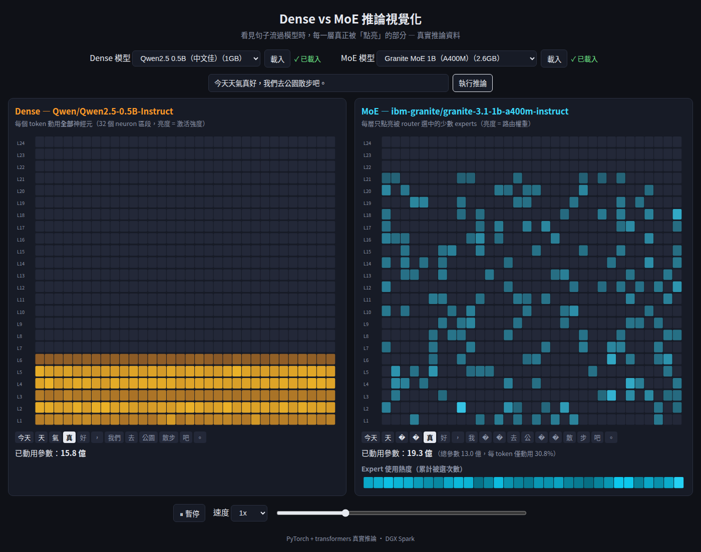

# densevsmoe — Dense vs MoE 推論視覺化

從 HuggingFace 策展清單各選一個 dense 與一個 MoE 模型，輸入一個句子，
以左右同步動畫視覺化**真實推論**時每一層被「點亮」的過程：

- **Dense 側**：每層 32 個 neuron 區段全部點亮，亮度 = MLP 激活強度 —— 每個 token 動用全部參數。
- **MoE 側**：每層只點亮 router 選中的 top-k experts，亮度 = 路由權重 —— 稀疏性一目了然。
- 即時「已動用參數量」計數器、expert 使用熱度圖、播放／暫停／調速／點 token 跳轉。



## 需求

- Python 3.11+、[uv](https://docs.astral.sh/uv/)
- NVIDIA GPU（開發環境：DGX Spark，arm64 + CUDA 13）；無 GPU 會退回 CPU（較慢）

## 快速開始

```bash
uv sync
uv run uvicorn server.main:app --port 8000
```

開啟 http://localhost:8000 ，兩側各選模型按「載入」，輸入句子按「執行推論」。

## 支援模型

| 類型 | 模型 | 大小 (bf16) |
|------|------|------|
| Dense | openai-community/gpt2 | 0.3GB |
| Dense | Qwen/Qwen2.5-0.5B-Instruct | 1GB |
| MoE | ibm-granite/granite-3.1-1b-a400m-instruct | 2.6GB |
| MoE | allenai/OLMoE-1B-7B-0924-Instruct | 14GB |

## 原理

推論只跑一次：後端（FastAPI + PyTorch）對句子做一次前向傳播，
以 forward hook 擷取 dense 各層 MLP 激活強度、以 `output_router_logits=True`
擷取 MoE 各層 router top-k 路由，打包成 JSON；前端（原生 JS + SVG）重播動畫，
暫停／倒帶／調速都不需重新推論。

## 測試

```bash
uv run pytest                                            # 單元 + API + 真模型測試
uv run pytest tests/test_e2e.py -m e2e --override-ini addopts=""  # e2e（Playwright）
```

## 疑難排解

### Triton cache 權限

若 `~/.triton` 不可寫（例如曾被 root 行程建立），跑 MoE 推論前設：

```bash
export TRITON_CACHE_DIR=/tmp/triton-cache
```

### 埠被占用

若 8000 被占（例如本機有 vLLM 常駐），改用其他埠：

```bash
uv run uvicorn server.main:app --port 8080
```

### 記憶體

載入模型前系統會檢查可用記憶體（`MemAvailable`），不足會回明確錯誤。預設組合（Qwen2.5-0.5B + Granite MoE，約 4GB）。
